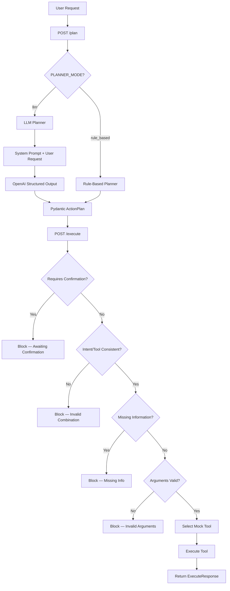

# SaaS Ops AI Agent — LLM-Ready AI Workflow Orchestrator

A FastAPI-based workflow orchestrator that converts natural-language SaaS operations requests into structured, validated action plans and executes mock tools.

This project demonstrates the core architecture of an AI agent system:

```text
Natural language request
→ structured action plan (via rule-based planner or LLM)
→ tool selection
→ validation
→ execution
→ auditable result
```

The system supports two planner modes:
- **Rule-based** (default): regex-based intent detection, zero external dependencies.
- **LLM** (`PLANNER_MODE=llm`): OpenAI structured outputs for natural-language understanding.

Both modes produce the same `ActionPlan` schema, and the executor is planner-agnostic.

---

## Why I Built This

Modern AI engineering is not only about training models from scratch. Many real-world AI systems use LLMs to:

- understand user intent
- extract structured parameters
- select tools
- call APIs
- validate missing information
- execute workflow steps safely

This project demonstrates that pattern in a SaaS operations context, with a dual-planner architecture that shows both the rule-based baseline and the LLM-powered upgrade path.

---

## Features

- FastAPI backend with Pydantic request/response schemas
- Dual planner modes: rule-based (regex) and LLM (OpenAI structured outputs)
- OpenAI structured output via `response_format` (strict JSON schema)
- Structured action plans with intent, tool, arguments, and confidence
- Safe `/plan` → `/execute` two-phase workflow
- Safety gates: confirmation checks, intent/tool validation, argument validation
- Missing-information detection (both planners)
- Mock tool execution with auditable action logs
- 48 unit and API tests with pytest (LLM tests fully mocked)
- Swagger documentation through FastAPI

---

## Planner Modes

### Rule-Based (default)

The rule-based planner uses keyword matching and regex to detect intent and extract arguments. It requires no API key and runs fully offline.

```bash
# Uses rule-based planner by default
uvicorn app.main:app --reload
```

### LLM (OpenAI Structured Outputs)

The LLM planner sends the user request to OpenAI with a system prompt describing the available tools. The model returns a structured JSON response that maps directly to the `ActionPlan` Pydantic schema.

```bash
export PLANNER_MODE=llm
export OPENAI_API_KEY=your_key_here
uvicorn app.main:app --reload
```

The response includes `"planner_mode": "llm"` so the caller knows which planner generated the plan.

### Design Decision

The dual-planner architecture serves two purposes:
1. **Portfolio**: Demonstrates both traditional NLP and LLM integration in the same project.
2. **Production**: When the LLM planner encounters an API error at runtime, the `/plan` endpoint automatically falls back to the rule-based planner and logs the failure. A missing API key returns a clean 503 (configuration error, not a transient failure).

> **Note on confidence:** The `confidence` field is non-authoritative audit metadata. The rule-based planner assigns heuristic values; the LLM planner reports model-estimated values. It is not used as a safety gate by the executor.

---

## Supported Actions

The MVP currently supports three SaaS operations actions:

| Intent | Tool | Example Request |
|---|---|---|
| `create_workspace` | `create_workspace` | `Create a workspace for Acme Corp` |
| `generate_usage_report` | `generate_usage_report` | `Generate a usage report for Beta Corp` |
| `search_documentation` | `search_documentation` | `Search docs for workspace API` |

---

## Architecture



---

## Project Structure

```text
saas-ops-ai-agent/
  app/
    __init__.py
    main.py
    schemas.py
    services/
      __init__.py
      llm_planner.py
      planner.py
      tools.py
  tests/
    conftest.py
    test_api.py
    test_llm_planner.py
    test_planner.py
  README.md
  requirements.txt
  .env.example
  .gitignore
  .dockerignore
  Dockerfile
  Makefile
```

---

## API Endpoints

### `GET /health`

Checks whether the API is running.

Example response:

```json
{
  "status": "ok"
}
```

---

### `POST /plan`

Converts a natural-language request into a structured action plan. Uses the planner selected by `PLANNER_MODE`.

Example request:

```json
{
  "request": "Create a workspace for Acme Corp"
}
```

Example response (LLM mode):

```json
{
  "intent": "create_workspace",
  "tool_name": "create_workspace",
  "arguments": {
    "customer_name": "Acme Corp"
  },
  "missing_information": [],
  "requires_confirmation": false,
  "confidence": 0.92,
  "planner_mode": "llm"
}
```

---

### `POST /execute`

Executes a structured action plan. The executor is planner-agnostic — it validates and runs any well-formed `ActionPlan` regardless of which planner created it.

Example request:

```json
{
  "plan": {
    "intent": "create_workspace",
    "tool_name": "create_workspace",
    "arguments": {
      "customer_name": "Acme Corp"
    },
    "missing_information": [],
    "requires_confirmation": false,
    "confidence": 0.92
  }
}
```

Example response:

```json
{
  "status": "success",
  "message": "Workspace created for Acme Corp.",
  "action_log": [
    "Received action plan",
    "Validated customer_name",
    "Selected create_workspace tool",
    "Executed mock workspace creation"
  ],
  "result": {
    "workspace_id": "ws_acme_corp",
    "customer_name": "Acme Corp",
    "created": true
  }
}
```

---

## Safe Execution Example

If the user says:

```json
{
  "request": "Create a workspace"
}
```

Both planners detect that the customer name is missing:

```json
{
  "intent": "create_workspace",
  "tool_name": "create_workspace",
  "arguments": {},
  "missing_information": [
    "customer_name"
  ],
  "requires_confirmation": false,
  "confidence": 0.55
}
```

If this incomplete plan is sent to `/execute`, execution is stopped:

```json
{
  "status": "error",
  "message": "Cannot execute plan because required information is missing.",
  "action_log": [
    "Received action plan",
    "Missing information: customer_name",
    "Execution stopped"
  ],
  "result": {}
}
```

This demonstrates a basic safety pattern for AI agents: do not execute actions when required information is missing.

---

## Running Locally

Create and activate a virtual environment:

```bash
python3 -m venv .venv
source .venv/bin/activate
```

Install dependencies:

```bash
pip install -r requirements.txt
```

Run the API (rule-based mode):

```bash
uvicorn app.main:app --reload
```

Run the API (LLM mode):

```bash
export PLANNER_MODE=llm
export OPENAI_API_KEY=your_key_here
uvicorn app.main:app --reload
```

Open Swagger UI:

```text
http://127.0.0.1:8000/docs
```

---

## Running Tests

Tests do not require an API key. All LLM calls are mocked.

```bash
python -m pytest
```

---

## Configuration

```text
PLANNER_MODE=rule_based      # "rule_based" (default) or "llm"
OPENAI_API_KEY=your_key_here  # Required when PLANNER_MODE=llm
OPENAI_MODEL=gpt-4.1-mini    # Model for LLM planner (default: gpt-4.1-mini)
```

---

## Tech Stack

- Python
- FastAPI
- Pydantic
- OpenAI SDK (structured outputs)
- pytest
- Uvicorn

---

## Roadmap

- Add human confirmation flow for risky actions
- Add real API integrations
- Add persistent action audit logs
- Add authentication
- Add multi-step planning (plan chains)