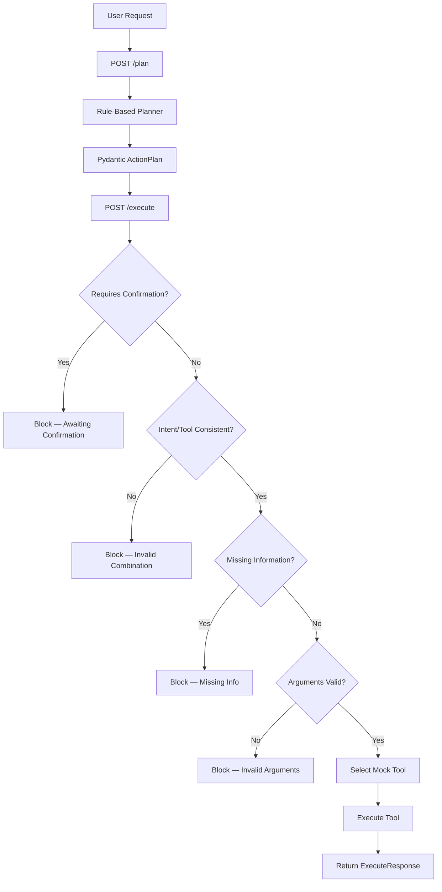

# SaaS Ops AI Agent — LLM-Ready AI Workflow Orchestrator

A FastAPI-based workflow orchestrator that converts natural-language SaaS operations requests into structured, validated action plans and executes mock tools.

This project demonstrates the core architecture of an AI agent system:

```text
Natural language request
→ structured action plan
→ tool selection
→ validation
→ execution
→ auditable result
```

The current MVP uses a rule-based planner. The system is designed so the planner can later be replaced with an LLM while keeping the same API schema.

---

## Why I Built This

Modern AI engineering is not only about training models from scratch. Many real-world AI systems use LLMs to:

- understand user intent
- extract structured parameters
- select tools
- call APIs
- validate missing information
- execute workflow steps safely

This project demonstrates that pattern in a SaaS operations context.

---

## Features

- FastAPI backend
- Pydantic request/response schemas
- Rule-based natural-language planner
- Structured action plans
- Safe `/plan` → `/execute` workflow
- Mock tool execution
- Missing-information validation
- Action logs for auditability
- Unit and API tests with pytest
- Swagger documentation through FastAPI

---

## Supported Actions

The MVP currently supports three SaaS operations actions:

| Intent | Tool | Example Request |
|---|---|---|
| `create_workspace` | `create_workspace` | `Create a workspace for Acme Corp` |
| `generate_usage_report` | `generate_usage_report` | `Generate a usage report for Beta Corp` |
| `search_documentation` | `search_documentation` | `Search docs for workspace API` |

---

## Architecture



---

## Project Structure

```text
saas-ops-ai-agent/
  app/
    __init__.py
    main.py
    schemas.py
    services/
      __init__.py
      planner.py
      tools.py
  tests/
    conftest.py
    test_api.py
    test_planner.py
  README.md
  requirements.txt
  .env.example
  .gitignore
  Makefile
```

---

## API Endpoints

### `GET /health`

Checks whether the API is running.

Example response:

```json
{
  "status": "ok"
}
```

---

### `POST /plan`

Converts a natural-language request into a structured action plan.

Example request:

```json
{
  "request": "Create a workspace for Acme Corp"
}
```

Example response:

```json
{
  "intent": "create_workspace",
  "tool_name": "create_workspace",
  "arguments": {
    "customer_name": "Acme Corp"
  },
  "missing_information": [],
  "requires_confirmation": false,
  "confidence": 0.86
}
```

---

### `POST /execute`

Executes a structured action plan.

Example request:

```json
{
  "plan": {
    "intent": "create_workspace",
    "tool_name": "create_workspace",
    "arguments": {
      "customer_name": "Acme Corp"
    },
    "missing_information": [],
    "requires_confirmation": false,
    "confidence": 0.86
  }
}
```

Example response:

```json
{
  "status": "success",
  "message": "Workspace created for Acme Corp.",
  "action_log": [
    "Received action plan",
    "Validated customer_name",
    "Selected create_workspace tool",
    "Executed mock workspace creation"
  ],
  "result": {
    "workspace_id": "ws_acme_corp",
    "customer_name": "Acme Corp",
    "created": true
  }
}
```

---

## Safe Execution Example

If the user says:

```json
{
  "request": "Create a workspace"
}
```

The planner detects that the customer name is missing:

```json
{
  "intent": "create_workspace",
  "tool_name": "create_workspace",
  "arguments": {},
  "missing_information": [
    "customer_name"
  ],
  "requires_confirmation": false,
  "confidence": 0.62
}
```

If this incomplete plan is sent to `/execute`, execution is stopped:

```json
{
  "status": "error",
  "message": "Cannot execute plan because required information is missing.",
  "action_log": [
    "Received action plan",
    "Missing information: customer_name",
    "Execution stopped"
  ],
  "result": {}
}
```

This demonstrates a basic safety pattern for AI agents: do not execute actions when required information is missing.

---

## Running Locally

Create and activate a virtual environment:

```bash
python3 -m venv .venv
source .venv/bin/activate
```

Install dependencies:

```bash
pip install -r requirements.txt
```

Run the API:

```bash
uvicorn app.main:app --reload
```

Open Swagger UI:

```text
http://127.0.0.1:8000/docs
```

---

## Running Tests

```bash
python -m pytest
```

---

## Example curl Commands

### Health check

```bash
curl http://127.0.0.1:8000/health
```

### Create action plan

```bash
curl -X POST http://127.0.0.1:8000/plan \
  -H "Content-Type: application/json" \
  -d '{"request": "Create a workspace for Acme Corp"}'
```

### Execute action plan

```bash
curl -X POST http://127.0.0.1:8000/execute \
  -H "Content-Type: application/json" \
  -d '{
    "plan": {
      "intent": "create_workspace",
      "tool_name": "create_workspace",
      "arguments": {
        "customer_name": "Acme Corp"
      },
      "missing_information": [],
      "requires_confirmation": false,
      "confidence": 0.86
    }
  }'
```

---

## Tech Stack

- Python
- FastAPI
- Pydantic
- pytest
- Uvicorn

---

## Roadmap

Planned improvements:

- Add LLM-backed planning mode
- Add OpenAI structured outputs
- Add human confirmation for risky actions
- Add real API integrations
- Add persistent action audit logs
- Add authentication
- Add deployment configuration